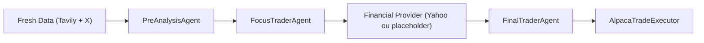

# Tutoriel V2 (pas a pas)

Ce tutoriel est pense comme un guide d'exploitation:

1. comprendre le workflow de bout en bout,
2. savoir lancer et verifier chaque brique independamment,
3. lire les artefacts pour debugger vite,
4. etendre l'architecture sans casser le pipeline.

## 1) Vue d'ensemble

Le projet a deux couches:

- `V1` legacy: scripts historiques (`run.py`, `grok_tools_test.py`, `reflex_trader_agent.py`).
- `V2` recommandee: pipeline segmentee (`run_v2.py`, `trading_pipeline/`).

Le flux V2:



Le point d'entree est `run_v2.py`.

## 2) Pre-requis

- Python `3.11+`
- virtualenv local `.venv`
- un fichier `.env` a la racine

Exemple minimal:

```env
TAVILY_API_KEY=tvly-...
ALPACA_API_KEY=...
ALPACA_API_SECRET=...
ALPACA_PAPER=true
PIPELINE_EXECUTE_ORDERS=false
# optionnel
XAI_API_KEY=...
```

Installation:

```bash
python3 -m venv .venv
source .venv/bin/activate
python -m pip install -r requirements.txt
```

## 3) Arborescence et roles

```text
trading_pipeline/
  agents/        # logique IA: pre-analysis, focus, decision finale
  collectors/    # collecte de donnees fraiches (web/social)
  financial/     # providers de donnees financieres (Yahoo, placeholder)
  execution/     # couche broker (Alpaca)
  workflow/      # orchestration du flux metier
scripts/
  smoke/         # tests connectivite API
  data/          # scripts benchmark et scripts finance standalone
tests/           # tests unitaires + pipeline
docs/            # documentation projet
run_v2.py        # CLI principale V2
run.py           # CLI legacy
```

Points importants:

- `trading_pipeline/models.py` definit les contrats de donnees entre branches.
- `trading_pipeline/workflow/pipeline.py` orchestre la sequence metier.
- `run_v2.py` compose les dependances et ecrit l'artefact final.

## 4) Workflow detaille (qui fait quoi)

### 4.1 Fresh data branch

- Web: `TavilyWebCollector` recupere des sources recentes et structurees.
- Social: `XPlaceholderCollector` injecte un flux social simplifie (placeholder/cache).
- Agrégation: `FreshDataHub` fusionne web + social en `fresh_snapshot`.

### 4.2 IA pre-analyse

- `PreAnalysisAgent` transforme le snapshot frais en synthese actionnable.
- Sortie principale: `candidate_symbols` (liste de symboles a filtrer).

### 4.3 IA focus trader

- `FocusTraderAgent` reduit la liste a un set de symboles priorises.
- Sortie: shortlist + questions metier pour la branche finance.

### 4.4 Branche finance

- `YahooFinancePoolProvider` enrichit chaque symbole avec prix/variations/metadata.
- `YahooPlaceholderProvider` sert de fallback pour tests hors reseau.

### 4.5 Decision finale + execution

- `FinalTraderAgent` combine signaux frais + finance et decide `LONG/SHORT/HOLD`.
- `AlpacaTradeExecutor` envoie ou simule les ordres selon `execute_live`.

## 5) Verifications rapides par brique

### 5.1 Smoke tests connectivite

```bash
.venv/bin/python scripts/smoke/alpaca_api_test.py
.venv/bin/python scripts/smoke/grok_api_test.py
```

### 5.2 Benchmark web search (Tavily)

```bash
.venv/bin/python scripts/data/tavily_search_example.py \
  --query "S&P 500 market drivers today" \
  --topic finance \
  --time-range day \
  --max-results 8 \
  --include-answer
```

Le JSON brut est sauvegarde dans:
`responses/tavily_search/tavily_search_<timestamp>.json`

### 5.3 Validation Yahoo Finance

```bash
.venv/bin/python scripts/data/testyfinance.py
.venv/bin/python scripts/data/testyfinance_advanced.py
```

Les CSV de prix sont ecrits dans `price_history/`.

## 6) Lancer le pipeline V2

### 6.1 Mode recommande (Yahoo reel, execution dry-run)

```bash
.venv/bin/python run_v2.py \
  --query "S&P 500 market drivers today" \
  --web-topic finance \
  --web-time-range day \
  --web-max-results 8 \
  --financial-provider yahoo \
  --once
```

Resultat:

- resume de la decision en console,
- artefact complet dans `pipeline_runs_v2/<timestamp>.json`.

### 6.2 Mode tests hors reseau finance

```bash
.venv/bin/python run_v2.py \
  --query "S&P 500 market drivers today" \
  --financial-provider placeholder \
  --financial-mock-file /tmp/financial_mock_v2.json \
  --once
```

### 6.3 Mode execution ordres

```bash
.venv/bin/python run_v2.py \
  --query "S&P 500 market drivers today" \
  --financial-provider yahoo \
  --execute-orders \
  --once
```

Dans ce mode, un resume des ordres s'affiche dans le terminal puis une confirmation explicite est demandee.
Il faut taper exactement `yes` pour envoyer les ordres a Alpaca.

Sans `--execute-orders`, les ordres restent en `dry_run`.

Pour un run non-interactif (CI/automation), bypass de confirmation:

```bash
.venv/bin/python run_v2.py \
  --query "S&P 500 market drivers today" \
  --financial-provider yahoo \
  --execute-orders \
  --auto-confirm-orders \
  --once
```

### 6.4 Mode boucle continue

Le mode boucle est actif par défaut. Exemple toutes les 5 minutes:

```bash
.venv/bin/python run_v2.py \
  --query "S&P 500 market drivers today" \
  --financial-provider yahoo \
  --execute-orders \
  --interval-seconds 300
```

Arrêt automatique si marché fermé:

```bash
.venv/bin/python run_v2.py \
  --query "S&P 500 market drivers today" \
  --financial-provider yahoo \
  --execute-orders \
  --interval-seconds 300 \
  --stop-if-market-closed
```

Avec ce flag, le script vérifie l'horloge Alpaca avant chaque cycle.
Si le marché est fermé, il affiche le délai avant réouverture puis quitte.

Exemple toutes les 10 minutes:

```bash
.venv/bin/python run_v2.py \
  --query "S&P 500 market drivers today" \
  --financial-provider yahoo \
  --execute-orders \
  --interval-seconds 600
```

Run unique (sans boucle):

```bash
.venv/bin/python run_v2.py \
  --query "S&P 500 market drivers today" \
  --financial-provider yahoo \
  --once
```

Arrêt propre:
- `Ctrl+C`

## 7) Lire un artefact pipeline

Un artefact `pipeline_runs_v2/<timestamp>.json` contient au minimum:

- `fresh_snapshot`
- `pre_analysis`
- `focus_selection`
- `financial_snapshot`
- `final_decision`
- `execution_report`

Schema logique (simplifie):

```json
{
  "fresh_snapshot": {},
  "pre_analysis": {"candidate_symbols": ["AAPL", "MSFT"]},
  "focus_selection": {"focus_symbols": ["AAPL"]},
  "financial_snapshot": {"symbols_data": {"AAPL": {"last_price": 0.0}}},
  "final_decision": {"action": "HOLD", "orders": []},
  "execution_report": {"status": "dry_run", "message": "..."}
}
```

## 8) Tests projet

Lancer toute la suite:

```bash
.venv/bin/python -m unittest discover -s tests -v
```

La suite couvre:

- helpers legacy (parsing, robustesse JSON),
- pipeline V2 en scenario mocke,
- utilitaires Tavily,
- provider Yahoo pool.

## 9) Extension propre de l'architecture

Ajouter un collecteur social X reel:

- implementer l'interface dans `trading_pipeline/collectors/`,
- conserver `FreshDataHub` comme point unique d'agregation.

Ajouter un provider financier:

- implementer `FinancialDataProvider` dans `trading_pipeline/financial/base.py`,
- brancher le provider dans `run_v2.py` via une nouvelle option CLI.

Faire evoluer les agents:

- modifier `trading_pipeline/agents/`,
- garder les contrats de `trading_pipeline/models.py` stables.

## 10) Depannage rapide

- `TAVILY_API_KEY manquante`: verifier `.env` et relancer dans le bon shell.
- `ConnectionError api.tavily.com`: verifier connectivite/DNS local.
- `Credentials Alpaca manquants`: renseigner `ALPACA_API_KEY` et `ALPACA_API_SECRET`.
- `Aucun ordre soumis`: action finale `HOLD`, `--execute-orders` non active, ou confirmation utilisateur non valide (attendu: `yes`).
- `Pipeline sans symbole`: regarder `pre_analysis.candidate_symbols` puis `focus_selection.focus_symbols`.
